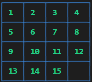
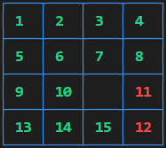

# Tucil_3_Stima

Tugas Kecil 3 Strategi Algoritma
Penyelesaian Persoalan 15-Puzzle dengan Algoritma Branch and Bound

Oleh: Nathanael Santoso/13520129

## Requirement

Python Version 3.10.2 ( Only Tested On This Version )

Program tidak akan bekerja pada versi python yang tidak memiliki implementasi match case

Libraries:
- pandas
- tabulate
- colorama

Jika terdapat library yang belum ada, bisa melakukan "pip install {nama_library}" untuk mendapatkannya

## Cara Penggunaan

1. Pada folder repository, masukkan "cd src"
2. Masukkan "python BranchAndBound.py" untuk menjalankan program secara default
3. Ada beberapa argument tambahan yang dapat dimasukkan yaitu:
  - '-v' atau '-verbose', akan mengubah luaran menjadi standar ASCII dan menambahkan luaran pohon ruang status, urutan pembangkitan simpul, dan solusi dalam bentuk Node
  - angka, akan mengubah kedalaman Pseudorandom Generation dari puzzle, semakin dalam akan semakin rumit sehingga mungkin program akan memakan waktu yang cukup lama untuk kedalaman yang tinggi. (e.x. Kedalaman berarti jumlah arah yang diterapkan pengacak pada matriks tujuan hingga mencapai matriks masukan, misalkan jika dimasukkan 2, maka pengacak akan mengambil matriks tujuan, kemudian menerapkan 2 arah (cth. 'DOWN', 'RIGHT') sehingga matriks masukkan seperti pada gambar di bawah)

    

  - Nama File, akan mengubah masukan menjadi file dengan nama file masukan yang terletak pada folder test. (e.x. jika masukan "python BranchAndBound.py known_test.txt" akan membuka file known_test.txt dari folder test )

Catatan:
  - Disarankan untuk pengetesan dilakukan dengan argumen '-v' agar lebih lengkap dan dipipe ke dalam file (e.x. Penggunaan seperti "python BranchAndBound.py -v known_test.txt > ../test/known_test.out" akan mengeluarkan luaran pada file known_test.out pada folder test )
  - Argumen Depth dan File tidak dapat dimasukkan bersamaan dan argumen Verbose harus selalu berada di posisi argumen pertama.